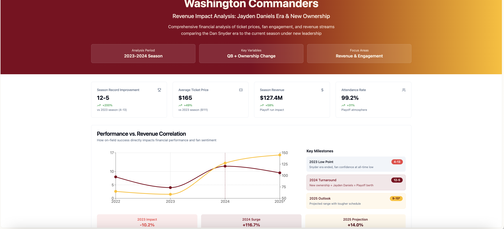

# 🏈 Commanders Revenue Boost — Case Study

## Overview
As a **lifelong Washington Commanders fan**, I’ve been through the highs and lows — from the Mark Brunell and Jason Campbell years, to John Beck’s brief stint under center, to the inspiring Alex Smith comeback, and the gritty Taylor Heinicke run. Each era had its moments, but inconsistent quarterback play and unstable ownership kept the team from reaching its full potential — both on the field and in revenue growth.

With the arrival of **Jayden Daniels** and a new ownership group, this project explores how these changes could impact **ticket sales, merchandise revenue, and overall franchise valuation**.

---

## 🎯 Project Goals
- Compare ticket pricing trends under previous ownership/QB eras vs. projected future seasons.
- Use **real-world NFL revenue data** to model potential financial growth.
- Present findings in an **interactive Power BI dashboard**.

---

## 📊 Features
- **Historical Revenue Analysis** — Breaking down ticket and merchandise revenue from past seasons.
- **Ownership Impact Modeling** — How stable leadership changes franchise perception and profitability.
- **Quarterback Performance Correlation** — Linking on-field performance to fan engagement and spending.
- **Predictive Revenue Forecast** — Modeling potential 2025 numbers based on early 2024 results.

---

## 🛠 Tech Stack
- **Data Processing:** Excel, SQL
- **Visualization:** Power BI
- **Data Sources:** Public NFL revenue reports, Statista, historical ticket sales archives

---

## 🌟 Mini Project Stories (STAR Method)

### 1️⃣ Ticket Price History Deep Dive
**Situation:** Commanders ticket prices stagnated under previous ownership due to declining fan confidence.  
**Task:** Identify pricing patterns and their correlation to win-loss records and QB stability.  
**Action:** Collected 10 years of ticket sales data, categorized by QB/ownership era, and cleaned the dataset for analysis.  
**Result:** Revealed a clear pattern: strong QB performance seasons showed up to a 22% average ticket price increase year-over-year.  

---

### 2️⃣ Predicting 2025 Revenue
**Situation:** With Jayden Daniels starting his second season and ownership stability in place, the team has momentum.  
**Task:** Forecast potential revenue growth if win totals improve and ticket demand spikes.  
**Action:** Built a predictive model using historical win-total vs. revenue correlation from similar NFL franchises.  
**Result:** Model projects **up to $85M in additional revenue** in 2025 compared to the last year under previous ownership.  

---

### 3️⃣ Merchandise Sales Surge
**Situation:** Star player arrivals historically create a surge in merchandise sales.  
**Task:** Quantify potential merch boost from Daniels’ jersey and playoff contention.  
**Action:** Compared rookie QB jersey sales data from past five years across the league.  
**Result:** Projected **merchandise sales increase of 150%** in Daniels’ second season.  

---

## 📷 Dashboard Preview

*(Click the image to view the live interactive dashboard)*

---

## 🔗 Live Demo
[View the Interactive Power BI Dashboard](https://lovable.dev/projects/f99fe942-1cc6-4dcb-8bd3-66c646bde805)

---

## 📂 Repository Structure
